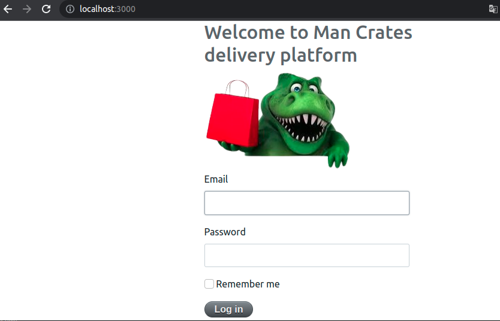

## Delivery_t Project 
This is an exercise/proof of concept of a shipping platform.

## Project Set-Up

The project consists of an application of Ruby on Rails version 5.2.2 and Ruby 2.5.1. The project started from a .zip file with the code.
In the first instance, the installation of the dependencies and the checking of the gem versions was carried out.
To install the project, you can use rbenv to use the corresponding local ruby ​​version. Subsequently, the bundle install is performed to install all the project dependencies.

## Databases

The project used Postgres and Redis databases, they can be installed locally to run the application or use the docker-compose that allows you to create the databases directly for use in the project. Once the database is configured, migrations and seeds are run to load test data.

## App

The app allows the creation of shipping orders for products stored in the system. To use the application, authentication will be completed by entering a user's username and password. This measure is more than anything to prevent any individual from connecting and using the services. On the other hand, the actions that a user can perform are limited.

## Admin

The App includes an admin portal to manage users, admins and orders. Basically it allows you to manage the application from behind, it has more functionalities than in the app with user authentication.

## Sidekiq

Orders are updated asynchronously, for this purpose sidekiq is used with a cron set to 15 minutes. The job is responsible for verifying the status of an order and its external ID with an external service. Update them in our system and send an email to the manager.

## Test

The project uses rspec and capybara to run a test suite. It can be run with the command bundle exec rspec spec/ . In turn, every time the tests are run, a coverage file is generated by the simplecov gem.

## Demo
Here I left two small videos to share as a demo.

https://drive.google.com/drive/folders/1eGskqsbp-5ozwHIWeWkbXWnVIIr2pVXF?usp=sharing